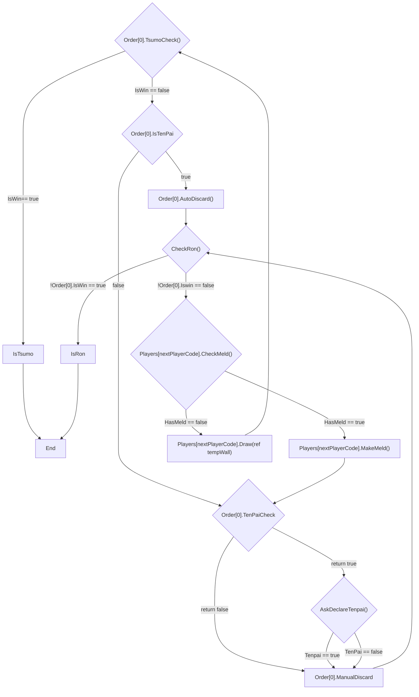

```mermaid
graph TB
State.CheckTsumo{"Order[0].TsumoCheck()"}-->|IsWin== true| State.IsTsumo
State.CheckTsumo-->|IsWin == false| State.IsTenPai

State.IsTsumo[IsTsumo]-->End

State.IsTenPai{"Order[0].IsTenPai"}-->|true| State.AutoDiscard
State.IsTenPai-->|false| State.CheckTenPai

State.AutoDiscard["Order[0].AutoDiscard()"] -->State.CheckRon

State.CheckTenPai{"Order[0].TenPaiCheck"} --> |return true| State.AskDeclareTenPai
State.CheckTenPai--> |return false| State.ManualDiscard

State.AskDeclareTenPai{"AskDeclareTenpai()"}-->|Tenpai == true|State.ManualDiscard
State.AskDeclareTenPai-->|TenPai == false|State.ManualDiscard

State.ManualDiscard["Order[0].ManualDiscard"]-->State.CheckRon

State.CheckRon{"CheckRon()"}--> |"!Order[0].IsWin == true"| State.IsRon

State.IsRon[IsRon] --> End
State.CheckRon-->|"!Order[0].Iswin == false"| State.CheckMeld

State.CheckMeld{"Players[nextPlayerCode].CheckMeld()"} -->|HasMeld == true| State.MakeMeld
State.CheckMeld-->|HasMeld == false|State.DrawFromWall

State.MakeMeld["Players[nextPlayerCode].MakeMeld()"] --> State.CheckTenPai

State.DrawFromWall["Players[nextPlayerCode].Draw(ref tempWall)"]-->State.CheckTsumo

```
