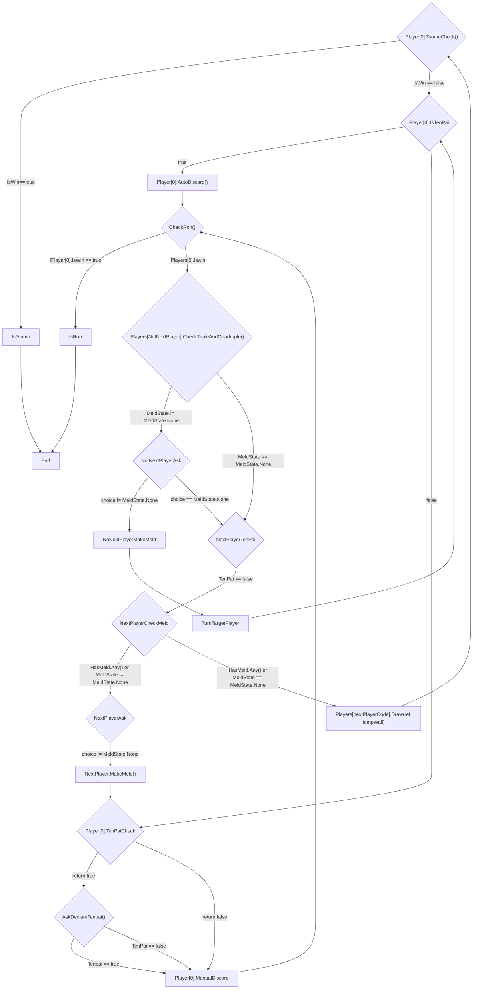

```mermaid
graph TB
State.CheckTsumo{"Player[0].TsumoCheck()"}-->|IsWin== true| State.IsTsumo
State.CheckTsumo-->|IsWin == false| State.IsTenPai

State.IsTsumo[IsTsumo]-->End

State.IsTenPai{"Player[0].IsTenPai"}-->|true| State.AutoDiscard
State.IsTenPai-->|false| State.CheckTenPai

State.AutoDiscard["Player[0].AutoDiscard()"] -->State.CheckRon

State.CheckTenPai{"Player[0].TenPaiCheck"} --> |return true| State.AskDeclareTenPai
State.CheckTenPai--> |return false| State.ManualDiscard

State.AskDeclareTenPai{"AskDeclareTenpai()"}-->|Tenpai == true|State.ManualDiscard
State.AskDeclareTenPai-->|TenPai == false|State.ManualDiscard

State.ManualDiscard["Player[0].ManualDiscard"]-->State.CheckRon

State.CheckRon{"CheckRon()"}--> |"!Player[0].IsWin == true"| State.IsRon

State.IsRon[IsRon] --> End
State.CheckRon-->|"!Players[0].Iswin"| State.CheckMeld

State.CheckMeld{"Players[NotNextPlayer].CheckTripleAndQuadruple()"} -->|"MeldState != MeldState.None"| NotNextPlayerAsk

NotNextPlayerAsk{"NotNextPlayerAsk"}-->|"choice != MeldState.None"| NotNextPlayerMakeMeld

NotNextPlayerMakeMeld[NoNextPlayerMakeMeld]-->TurnTargetPlayer
TurnTargetPlayer[TurnTargetPlayer]-->State.IsTenPai
NotNextPlayerAsk-->|"choice == MeldState.None"|NextPlayerTenPai

State.CheckMeld-->|MeldState == MeldState.None| NextPlayerTenPai
NextPlayerTenPai{NextPlayerTenPai}-->|TenPai == false| NextPlayerCheckMeld

NextPlayerCheckMeld{NextPlayerCheckMeld}-->|"HasMeld.Any() or MeldState != MeldState.None"| NextPlayerAsk

NextPlayerAsk{NextPlayerAsk} --> |"choice != MeldState.None"| State.MakeMeld

NextPlayerCheckMeld-->|"!HasMeld.Any() or MeldState == MeldState.None"|State.DrawFromWall

State.MakeMeld["NextPlayer.MakeMeld()"] --> State.CheckTenPai

State.DrawFromWall["Players[nextPlayerCode].Draw(ref tempWall)"]-->State.CheckTsumo

```
